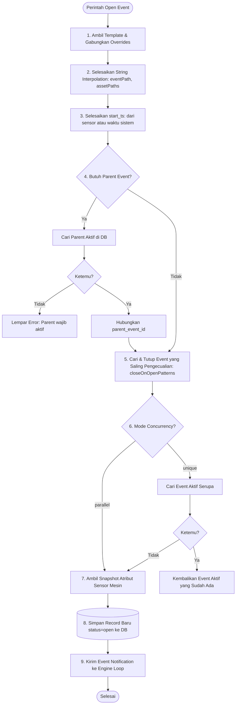

# Event Domain Manual

Domain `event` adalah pemilik event runtime: open, close, query, acknowledge, delete, cache open event, dan lifecycle event template.

## Tugas Inti Domain

- menginisialisasi event store
- mengelola template event
- menyediakan operasi open/close/query/delete event
- memisahkan logic repository, cache, dan template lifecycle

## Domain Ini Melayani Apa

Domain ini melayani:

- `context.eventSys`
- event action
- flow trigger yang bergantung pada event
- runtime API untuk event management

## Input Domain

- DB manager
- request open/close/query event
- event template definitions
- asset store untuk auto-capture dan template resolution

## Output Domain

- `EventStore`
- `EventRow`
- hasil query event
- metadata event store
- template map yang sudah dinormalisasi

## Struktur Internal

Area utama:

- root `event/`: facade dan orchestration domain
- `store/`: persistence, SQL support, row mapping, cache
- `template/`: template normalization, resolution, lifecycle

## File Penting

- [`EventDomainController.ts`](/d:/DEV/kufayeka/node_red_style_event_loop/runtime/event/EventDomainController.ts)
- [`EventDomainService.ts`](/d:/DEV/kufayeka/node_red_style_event_loop/runtime/event/EventDomainService.ts)
- [`EventQuerySupport.ts`](/d:/DEV/kufayeka/node_red_style_event_loop/runtime/event/EventQuerySupport.ts)
- [`EventStoreAccess.ts`](/d:/DEV/kufayeka/node_red_style_event_loop/runtime/event/EventStoreAccess.ts)

Store layer:

- [`EventStoreService.ts`](/d:/DEV/kufayeka/node_red_style_event_loop/runtime/event/store/EventStoreService.ts)
- [`PostgresEventRepository.ts`](/d:/DEV/kufayeka/node_red_style_event_loop/runtime/event/store/PostgresEventRepository.ts)
- [`OpenEventCache.ts`](/d:/DEV/kufayeka/node_red_style_event_loop/runtime/event/store/OpenEventCache.ts)
- [`EventSqlSupport.ts`](/d:/DEV/kufayeka/node_red_style_event_loop/runtime/event/store/EventSqlSupport.ts)
- [`EventRowMapper.ts`](/d:/DEV/kufayeka/node_red_style_event_loop/runtime/event/store/EventRowMapper.ts)

Template layer:

- [`EventTemplateService.ts`](/d:/DEV/kufayeka/node_red_style_event_loop/runtime/event/template/EventTemplateService.ts)
- [`EventTemplateNormalizer.ts`](/d:/DEV/kufayeka/node_red_style_event_loop/runtime/event/template/EventTemplateNormalizer.ts)
- [`EventTemplateResolver.ts`](/d:/DEV/kufayeka/node_red_style_event_loop/runtime/event/template/EventTemplateResolver.ts)
- [`EventTemplateLifecycle.ts`](/d:/DEV/kufayeka/node_red_style_event_loop/runtime/event/template/EventTemplateLifecycle.ts)

## Rules Internal

- store domain harus tetap stateful dan menjadi satu pintu untuk operasi event
- cache open event tidak boleh mem-bypass repository contract
- logic template tidak boleh bercampur ke repository SQL
- `EventDomainService` adalah pemilik template list dan store instance untuk satu runtime

## Rules Kalau Mau Edit

- kalau ubah schema row event, cek `EventRowMapper`, repository, cache, API, dan template lifecycle
- kalau ubah concurrency/uniqueness template, cek `EventTemplateLifecycle`
- kalau ubah filter query, cek dampak ke cache dan SQL support
- jangan menaruh SQL literal ke file selain layer `store/` bila tidak perlu

## Kalau Mau Nambah Fitur

Gunakan pembagian ini:

- filter/query baru: `EventQuerySupport` atau `EventSqlSupport`
- operasi domain store baru: `EventStoreService`
- adaptasi backend SQL baru: repository layer
- behavior template baru: `template/`

